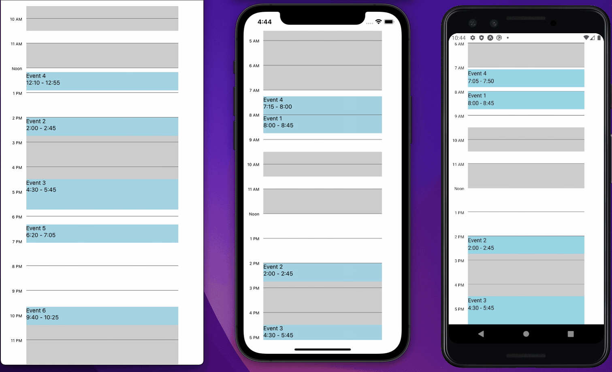

Customizable cross-platform React Native components for rendering calendars. Works out-of-the-box on iOS, Android, and Web.



## Usage

```
yarn add @lifeomic/react-native-calendar
```

See the in-line JSDoc for documentation on specific props.

```tsx
import { Calendar } from '@lifeomic/react-native-calendar';

const App = () => {
  const [events, setEvents] = React.useState([
    {
      id: 'event-one',
      title: 'Event One',
      startDate: new Date(),
      endDate: new Date(),
    },
  ]);

  return (
    <Calendar
      startDate={new Date()}
      events={events}
      onGridPress={(e, date) => {
        setEvents([
          ...events,
          {
            id: 'new-event',
            title: 'New Event',
            startDate: date,
            endDate: new Date(),
          },
        ]);
      }}
      onEventPress={(event) => {
        alert('Pressed event: ' + event.title);
      }}
    />
  );
};
```

### Customized Styling

To override the styling of the calendar, check out the `colors` and `renderers` props:

```tsx
<Calendar
  renderers={{
    eventContent: () => {
      // Render custom UI for events.
      return <View>{...}</View>
    }
  }}
  // Customize the colors of various built-in views.
  colors={{
    event: 'red'
  }}
/>
```
